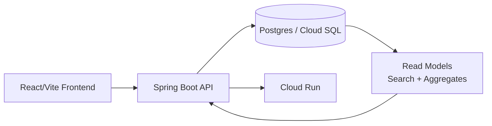

# Java Labs

A focused set of Java/Spring Boot implementation references for comparing full-stack
dashboard architecture, realtime updates, database-backed search, and deployment on GCP.

This repository acts as an index and notes hub. Source code for the listed
projects lives in their own repositories.

## Core Idea

Instead of treating Spring Boot as only a backend framework, these labs focus on:

> How Java applications behave when the API, realtime events, persistence, and
> operational setup all have to work together — alongside a React/Vite frontend.

## Goals

- Provide a single map of Java/Spring Boot implementation styles used in this workspace.
- Compare local development flow, data preparation, and production-shaped GCP infrastructure.
- Keep the dashboard backend and frontend easy to discover together.

## Architecture

## Projects

### 1. Dashboard Backend

**Repository:** [springboot-gcp-dashboard-backend](https://github.com/bganguly/springboot-gcp-dashboard-backend)

- Spring Boot 4 / Java 21 REST API
- Flyway migrations, Hibernate JPA, HikariCP
- Pre-aggregated read models for fast search and chart queries
- GCP deploy: Cloud Run + Cloud SQL + Artifact Registry via Terraform
- Demo infra scripts for GCP bring-up, teardown, seed, and read-model rebuild

### 2. Dashboard Frontend

**Repository:** [dashboard-frontend](https://github.com/bganguly/dashboard-frontend)

- React 19 + Vite + TypeScript
- Recharts stacked bar chart with date-range brush
- Paginated order search table with filters
- Dark mode, proxied to the Spring Boot backend in dev

## How To Use

Each project has its own README with full setup instructions.

**Local dev (start here):**

1. In `springboot-gcp-dashboard-backend`: run `./scripts/local-dev.sh` — checks prereqs, seeds the DB, runs diagnostics, starts on `8080`.
2. In a second terminal, in `dashboard-frontend`: follow the [frontend README](https://github.com/bganguly/dashboard-frontend) — opens on `3004`.
3. Search orders and verify chart/list consistency.

**GCP deploy:** `GCP_PROJECT=your-project-id ./scripts/infra-up.sh`, then `./scripts/prepare-demo-data.sh`, then `./scripts/deploy.sh`. Tear down with `./scripts/infra-down.sh`.

## Why This Matters

Java/Spring Boot projects often separate frontend and backend completely. These labs
make the full-stack tradeoffs visible: fast search via pre-aggregated read models,
chart responsiveness, GCP-native deployment, and local dev workflow all live in one
comparison surface.
