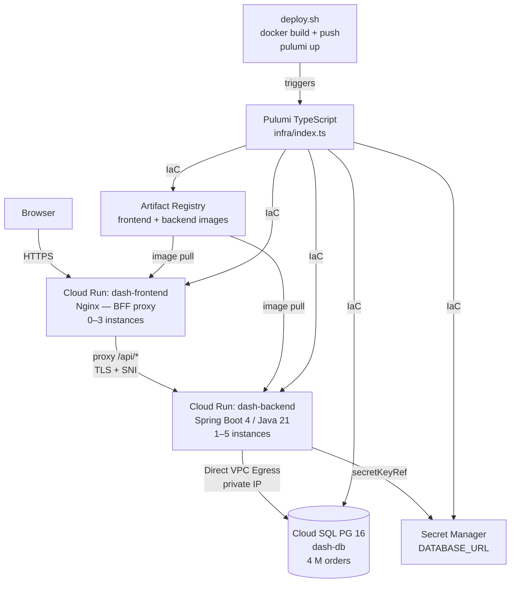

# Java Labs — Full-Stack Dashboard on GCP

A production-shaped **Java 21 / Spring Boot 4 + React 19 / TypeScript** reference implementation
delivering sub-second search and chart responses. 4 million orders in Cloud SQL PostgreSQL,
sub-second full-text search via GIN trigram index on a denormalized `search_text` column,
pre-aggregated analytics tables, and the entire GCP stack declared as **Pulumi TypeScript IaC**.

This repository is the index and architecture hub. Source code lives in the two sub-repos below.

---

## CVS JD Alignment

| JD Requirement | This Project |
|---|---|
| **Java / Spring Boot back-end** | Spring Boot 4, Java 21, NamedParameterJdbcTemplate, Flyway schema migrations |
| **React / TypeScript front-end** | React 19, TypeScript, Vite, Tailwind CSS, Recharts |
| **PostgreSQL — SQL, DML/DDL, performance tuning** | Cloud SQL PG 16; Flyway DDL; GIN trigram index; pre-aggregated `daily_summary` tables for millisecond chart queries on 4 M rows |
| **Serverless / cloud-native computing** | GCP Cloud Run (fully serverless, scales to zero, no cluster management) |
| **IaC (Terraform equivalent)** | **Pulumi TypeScript** — VPC, Cloud SQL, Cloud Run (frontend + backend), Secret Manager, Artifact Registry, IAM all declared in `infra/index.ts` |
| **CI/CD pipelines** | `deploy.sh` — docker build → push to Artifact Registry → `pulumi up --yes`; seed pipeline via `seed-via-proxy.sh` |
| **Secrets management** | GCP Secret Manager; `DATABASE_URL` injected via `secretKeyRef`, never in image or env file |
| **Networking, storage, DB architecture** | Private VPC, Direct VPC Egress, Private Service Connect, `db-custom-4-16384` Cloud SQL |
| **BFF / integration layer** | Nginx frontend proxies `/api/*` to Cloud Run backend with `proxy_ssl_server_name on` (TLS SNI) |
| **RESTful APIs / microservices** | Two independent Cloud Run services; paginated list + aggregates REST endpoints |
| **Performance optimization** | Sub-second search responses on 4 M rows via denormalized `search_text` + GIN trigram index — single ILIKE per token, no cross-table OR; sub-second chart responses from pre-aggregated tables, no full `orders` scan |
| **System design diagrams** | See architecture section below |

---

## Architecture



```
┌─────────────────────────────────────────────────────────────────────────┐
│                              GCP Project                                │
│                                                                         │
│   Artifact Registry  ◄── docker push (deploy.sh)                       │
│   ┌──────────────────┐                                                  │
│   │  frontend image  │                                                  │
│   │  backend image   │                                                  │
│   └──────────────────┘                                                  │
│           │ image pull                  Pulumi TypeScript               │
│           ▼                             (infra/index.ts)                │
│   ┌───────────────────────────────────────────────────────────────┐     │
│   │                       dash-vpc (private)                      │     │
│   │                                                               │     │
│   │  Cloud Run: dash-frontend          Cloud Run: dash-backend    │     │
│   │  ┌─────────────────────────┐       ┌──────────────────────┐   │     │
│   │  │ Nginx (port 80)         │       │ Spring Boot (8080)   │   │     │
│   │  │ serves Vite dist        │ HTTPS │ REST /api/*          │   │     │
│   │  │ proxies /api/* ─────────┼──────►│ Flyway migrations    │   │     │
│   │  │ proxy_ssl_server_name   │  SNI  │ 1–5 instances        │   │     │
│   │  │ 0–3 instances           │       └──────────┬───────────┘   │     │
│   │  └─────────────────────────┘                  │               │     │
│   │           ▲                          Direct VPC Egress        │     │
│   └───────────┼──────────────────────────────────┼───────────────┘     │
│               │ HTTPS                             │ private IP           │
│           Browser                    ┌────────────▼───────────┐        │
│                                      │  Cloud SQL PG 16       │        │
│                                      │  orders (4 M rows)     │        │
│                                      │  GIN trigram index     │        │
│                                      │  pre-agg summary tables│        │
│                                      │  Flyway V1–V4          │        │
│                                      └────────────────────────┘        │
│                                                                         │
│   Secret Manager                                                        │
│   ┌──────────────────────┐                                              │
│   │ dash-database-url    │◄── secretKeyRef (backend container env)      │
│   └──────────────────────┘                                              │
└─────────────────────────────────────────────────────────────────────────┘
```

---

## Projects

### 1. Dashboard Backend

**Repository:** [springboot-gcp-dashboard-backend](https://github.com/bganguly/springboot-gcp-dashboard-backend)

- Spring Boot 4 / Java 21 REST API (NamedParameterJdbcTemplate, Flyway, Lombok)
- Cloud SQL PostgreSQL 16 — GIN trigram index on `search_text` column for sub-second search; pre-aggregated daily summary tables for millisecond chart queries
- GCP deploy: Cloud Run + Cloud SQL + Artifact Registry + Secret Manager via **Pulumi TypeScript** (`infra/index.ts`)
- Startup probe extended to 15 min (`failureThreshold: 60`) to survive long Flyway migrations on 4 M rows
- `seed-via-proxy.sh` — restores 4 M order pg_dump directly on port 5432 via authorized-network whitelisting

### 2. Dashboard Frontend

**Repository:** [dashboard-frontend](https://github.com/bganguly/dashboard-frontend)

- React 19 + Vite + TypeScript, Tailwind CSS, Recharts
- Nginx BFF proxy: `/api/*` → Spring Boot backend with `proxy_ssl_server_name on` (required for Cloud Run SNI)
- Sub-second stacked bar chart with date-range brush; paginated order list with multi-filter sidebar
- Multi-stage Dockerfile (`node:22-alpine` build → `nginx:alpine`); deployed via **Pulumi** (`pulumi config set frontendImage` + `pulumi up --yes`)

---

## Scale & Performance

> **4 M+ orders** in Cloud SQL PostgreSQL 16 — sub-second full-text search via GIN trigram index; millisecond chart aggregates via pre-aggregated summary tables; zero sequential scans on the hot path.

## Live Services

| | URL |
|---|---|
| **Frontend** | https://dash-frontend-7u2hpcwtmq-uc.a.run.app |
| **Backend API** | https://dash-backend-7u2hpcwtmq-uc.a.run.app |

```bash
# health
curl https://dash-backend-7u2hpcwtmq-uc.a.run.app/actuator/health

# list (4 M+ rows, paginated)
curl "https://dash-backend-7u2hpcwtmq-uc.a.run.app/api/orders?page=1&size=3" | jq .total

# sub-second multi-token search
curl "https://dash-backend-7u2hpcwtmq-uc.a.run.app/api/orders?q=sara+carter&page=1&size=3" | jq '.data[].customer'

# chart aggregates (pre-aggregated, millisecond response)
curl "https://dash-backend-7u2hpcwtmq-uc.a.run.app/api/aggregates?from=2024-01-01&to=2024-12-31" | jq 'length'
```

---

## How To Use

### Local dev

1. In `springboot-gcp-dashboard-backend`: `./scripts/local-dev.sh` — checks prereqs (Java 21, Gradle, Postgres via SDKMAN), seeds the DB, starts on `:8080`
2. In a second terminal, in `dashboard-frontend`: `npm install && npm run dev` — opens on `:3004`

### Tear down

See [backend README](https://github.com/bganguly/springboot-gcp-dashboard-backend) for full GCP deploy and tear-down instructions.

---

## Why This Stack

Java/Spring Boot projects often decouple frontend and backend completely, hiding the full-stack
tradeoffs. This implementation makes them visible in one place: sub-second search responses via a
denormalized trigram-indexed column, millisecond chart queries via pre-aggregated read models,
Pulumi-declared GCP infrastructure, and a single `deploy.sh` entry point for each tier.
